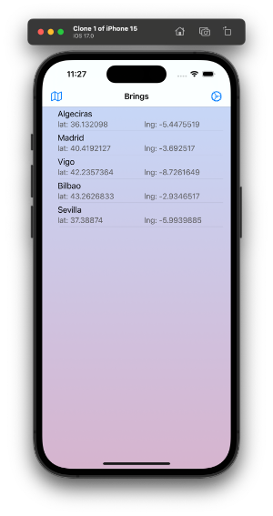
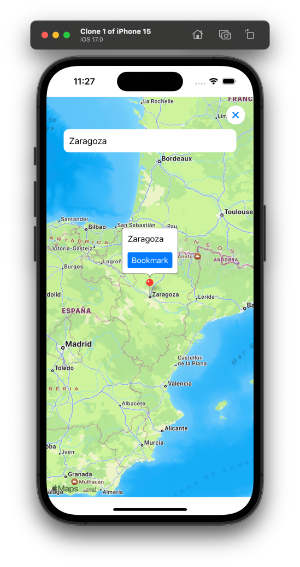
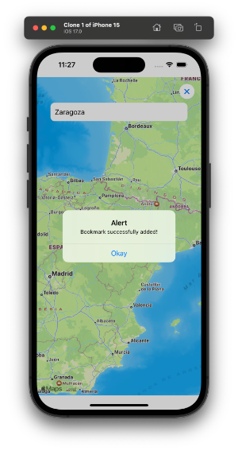
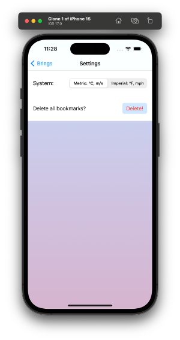
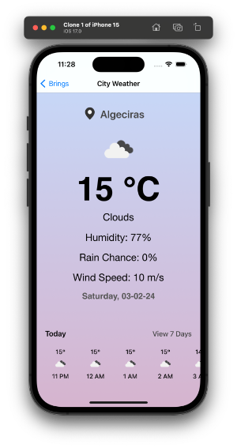
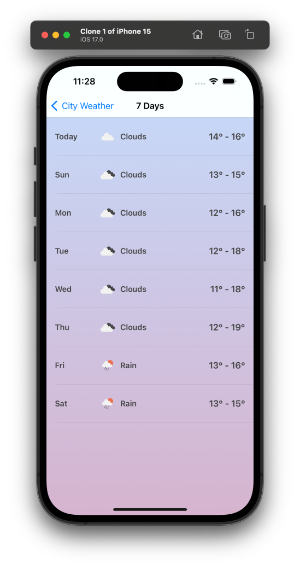
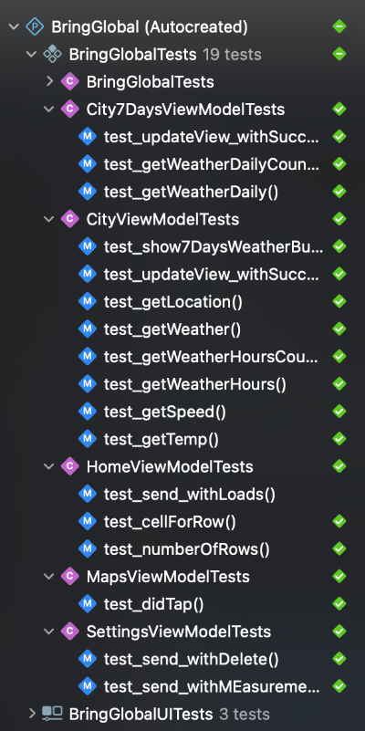

# Bring Global
technical challenge

# Documentation:
- I have selected the MVVM pattern with Swift.
- Calling to the API has been made without any third library, just my code/library.

# How to use the app
1. Open the app and select the map icon in the top left corner
2. In the map view, write for the city you would like to save
3. Tap over the pin and tap on the "Bookmark" button.
4. Go back to the home and you'll see your new location in the table view 🎉
5. Select any row and you'll navigate to the weather view with tons of info about the city you saved on the map.
6. At the bottom of the view you can tap on the "View 7 days button" to check the weather for the next 5-7 days.
7. Also you can tap on the settings icon from home to check all the settings from the app-

Screenshots

Unit Tests / UI Tests

Visit my blog for more info: [www.oscargarrucho.com](http://www.oscargarrucho.com/)

MIT License

Copyright (c) 2018 Chester How

Permission is as a result of this granted, free of charge, to any person obtaining a copy of this software and associated documentation files (the "Software"), to deal in the Software without restriction, including without limitation the rights to use, copy, modify, merge, publish, distribute, sublicense, and/or sell copies of the Software, and to permit persons to whom the Software is furnished to do so, subject to the following conditions:

The above copyright and permission notice shall be included in all copies or substantial portions of the Software.

THE SOFTWARE IS PROVIDED "AS IS", WITHOUT WARRANTY OF ANY KIND, EXPRESS OR IMPLIED, INCLUDING BUT NOT LIMITED TO THE WARRANTIES OF MERCHANTABILITY, FITNESS FOR A PARTICULAR PURPOSE AND NONINFRINGEMENT. IN NO EVENT SHALL THE AUTHORS OR COPYRIGHT HOLDERS BE LIABLE FOR ANY CLAIM, DAMAGES OR OTHER LIABILITY, WHETHER IN AN ACTION OF CONTRACT, TORT OR OTHERWISE, ARISING FROM, OUT OF OR IN CONNECTION WITH THE SOFTWARE OR THE USE OR OTHER DEALINGS IN THE SOFTWARE.

